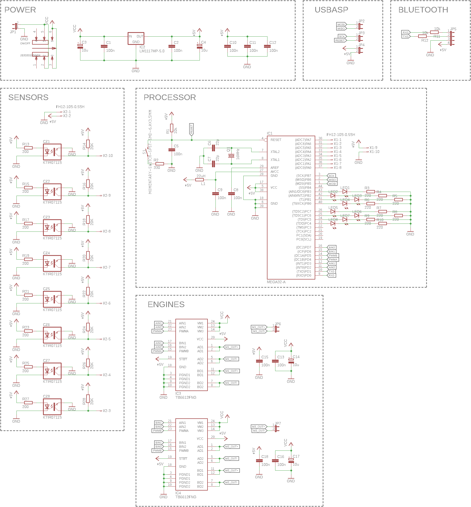
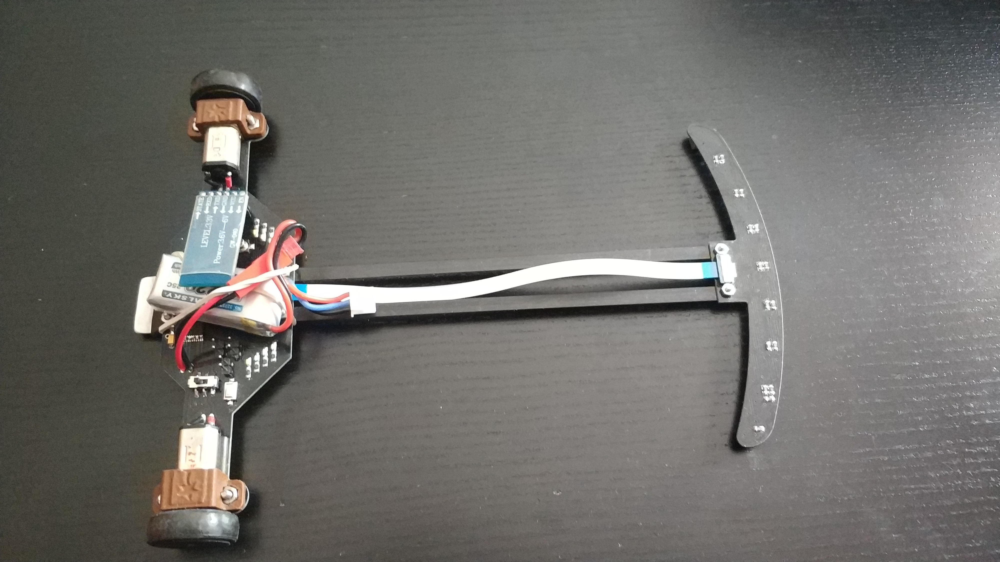
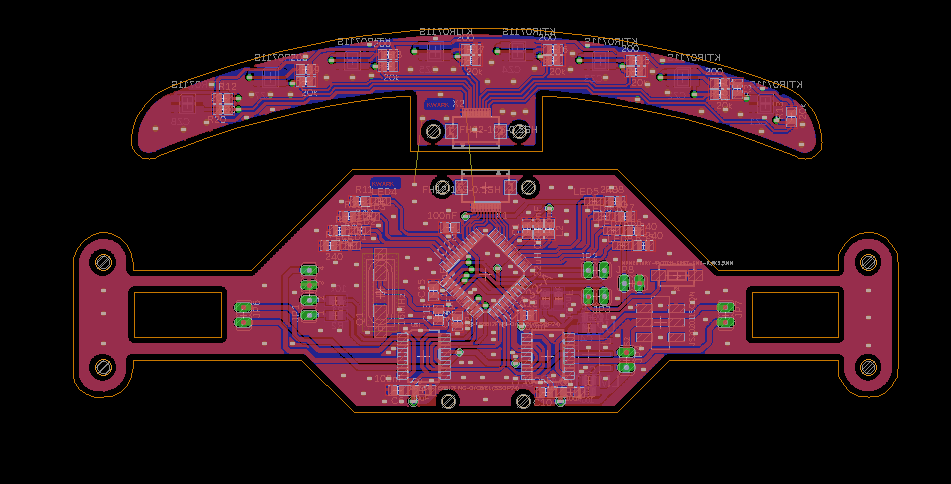

# Linefollower Atmega32
The linefollower is a autonomous robot which recognizes a line and moves along it.
## Partlist:
- CPU: Atmega32  
- sensors: 8x ktir0711s  
- H bridge: 2x Pololu TB6612FNG  
- bluetooth: HC-05  
- engines: 2x Pololu HP 10:1  

## Schematic:

## Pictures:

